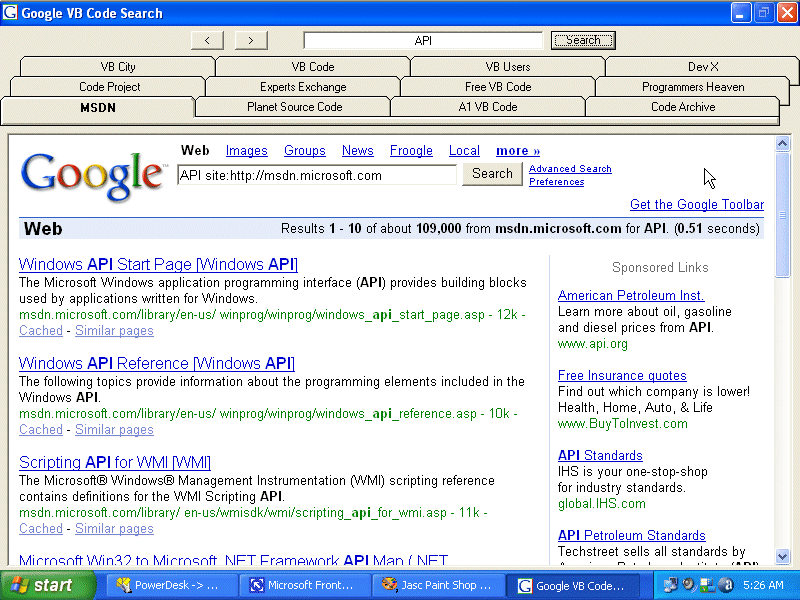



## Google Multiple Site Code Search

### Description

Search 12 of the top VB source code sites at the same time with a fully tabbed interface. Now don't get me wrong this code is nothing fancy but it does the job, it works &amp; looks good ! I am even uploading this submission with it ! LOL
 
### More Info
 

             |
---                |---
**Submitted On**   |2005-08-08 05:13:12
**By**             |[Thomas Swift](https://github.com/Planet-Source-Code/PSCIndex/blob/master/ByAuthor/thomas-swift.md)
**Level**          |Beginner
**User Rating**    |4.8 (43 globes from 9 users)
**Compatibility**  |VB 6\.0
**Category**       |[Miscellaneous](https://github.com/Planet-Source-Code/PSCIndex/blob/master/ByCategory/miscellaneous__1-1.md)
**World**          |[Visual Basic](https://github.com/Planet-Source-Code/PSCIndex/blob/master/ByWorld/visual-basic.md)
**Archive File**   |[Google\_Mul192221882005\.zip](https://github.com/Planet-Source-Code/thomas-swift-google-multiple-site-code-search__1-62124/archive/master.zip)

